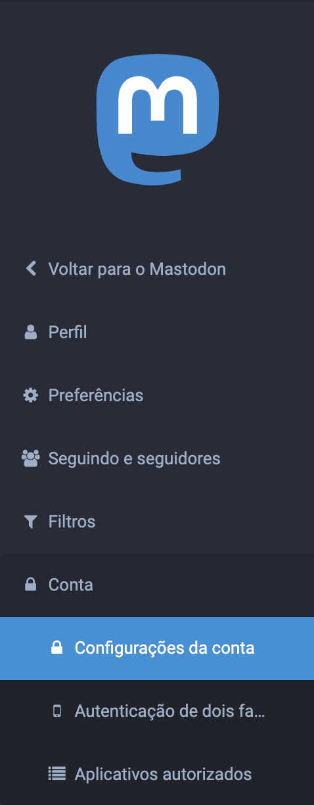
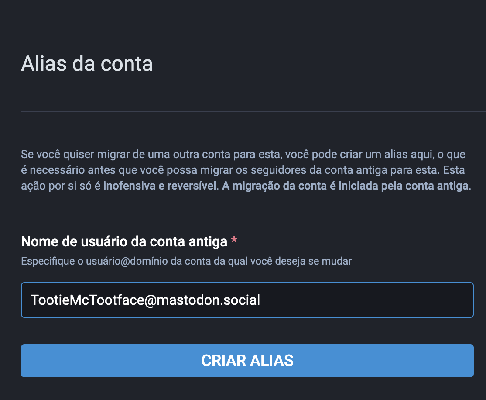
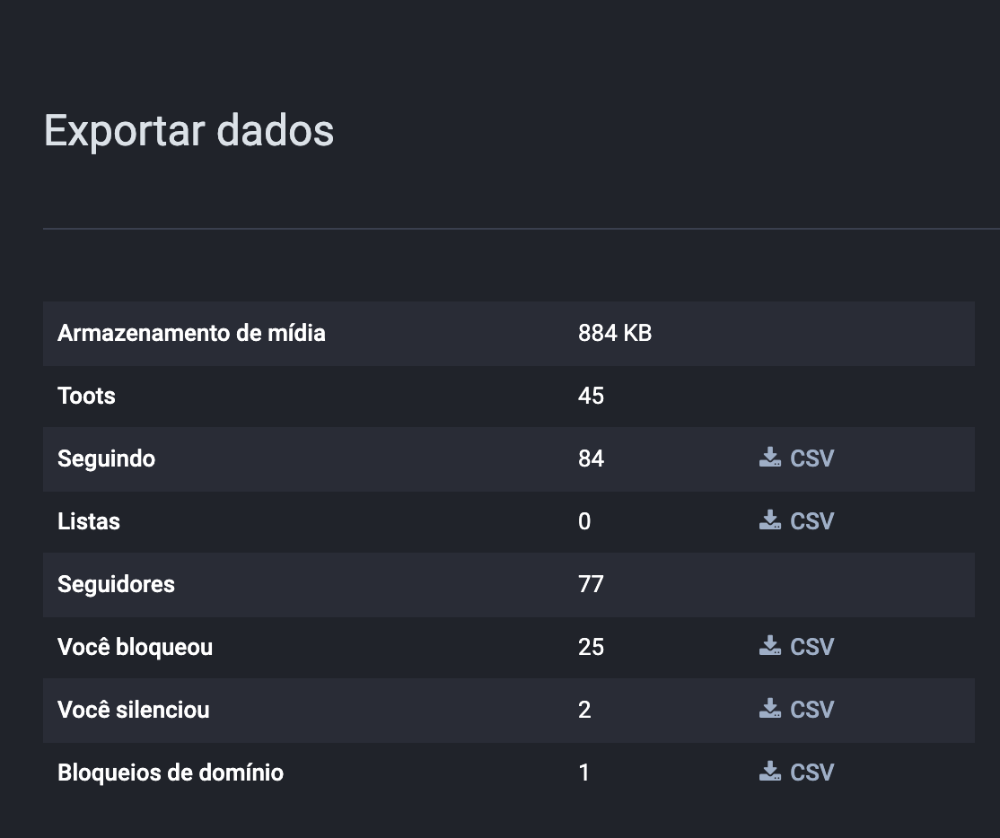
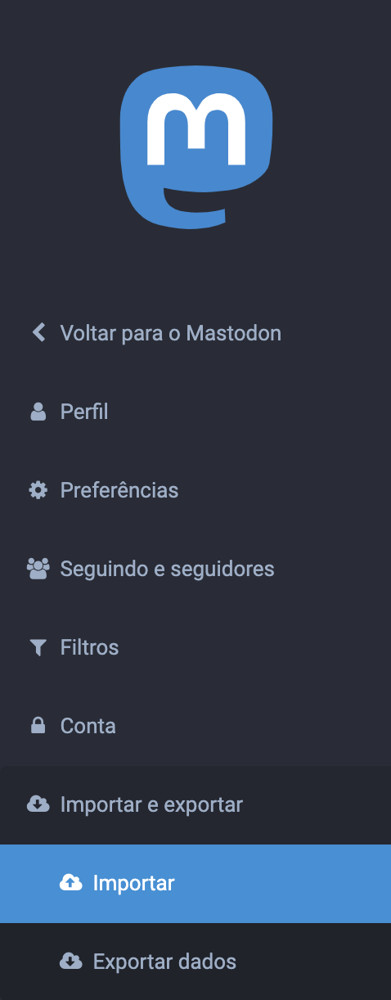
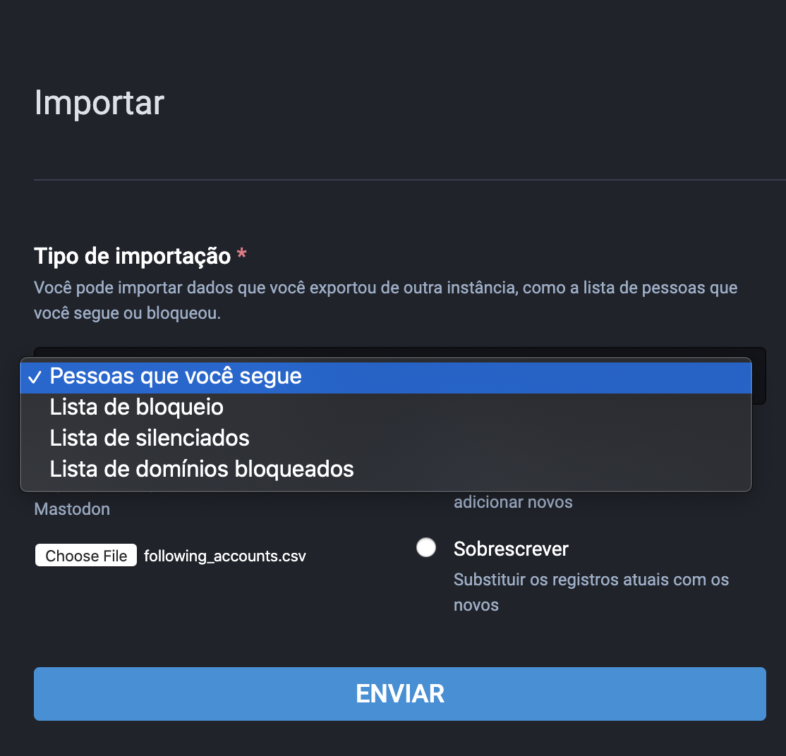
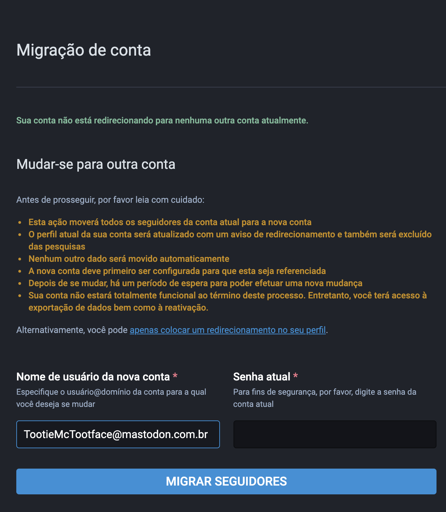

# Migrando de uma instância para outra

Primeiro de tudo, para migrar de uma instância para outra, você deve fazer uma nova conta na instância para a qual você quer mudar, então siga os passos abaixo:

1.  **Na nova instância** vá em `Preferências` > `Conta` > `Configurações da conta`

	

    Role a página, e em `Migrando de outra conta`, clique em `Criar um alias`

    

2.  Coloque o seu nome de usuário da instância que você está saindo (você encontra ele logo abaixo da sua foto no seu perfil)

    

3.  **Na instância antiga** faça **backup** dos seus dados em `Preferências` > `Importar e exportar` > `Exportar dados`

    

    Salve cada um dos arquivos disponíveis (não é possível salvar toots e seguidores nesse formato)

    

5. Em seguida **importe** esses aquivos **na nova instância** em `Preferências` > `Importar e exportar` > `Importar`.

    

    Selecione o tipo de arquivo no menu `Tipo de importação`.

    

    Escolha o arquivo a ser importado e então selecione se você quer `Juntar` ou `Sobrescrever` o arquivo existente. 

    Ao `Juntar` você **adiciona** o que tinha na instância antiga com o que tem na nova.

    Ao `Sobrescrever` você **apaga** o que tem na nova e mantém **apenas** o que estava na antiga.

    Clique `Enviar`.

6. Agora voltando para **a instância antiga**, vá em `Preferências` > `Conta` > `Configurações da conta`

    

    Role a página e em `Mudar-se para outra conta`, clique em `configurar isso aqui`.

    

7. Coloque seu nome de usuário **da nova instância** e clique em `Migrar seguidores`.

    

Pronto! Você migrou para uma nova instância!
